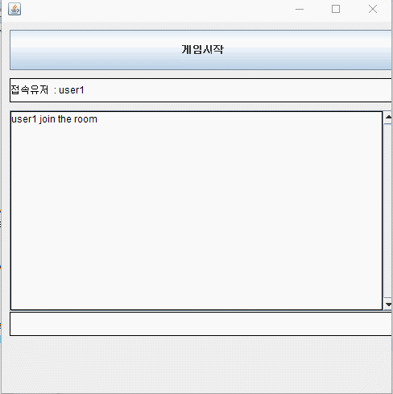
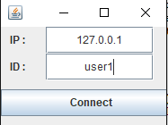
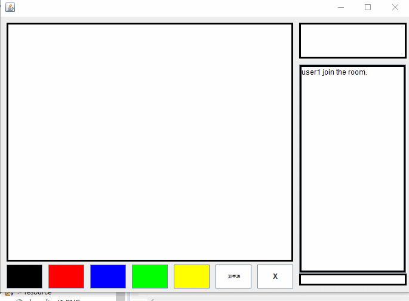
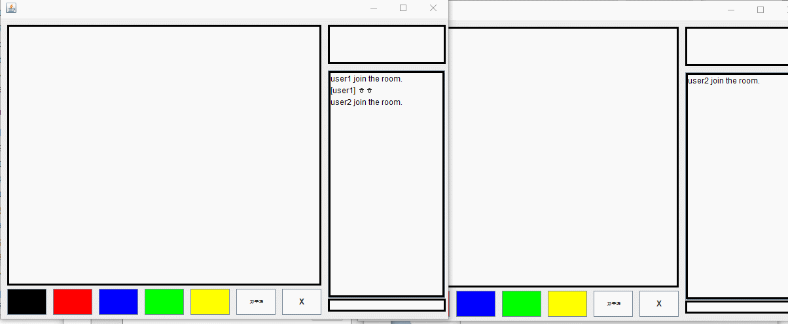

# drawMind

---------------------------------------
##### 사용 기술 : JavaSocket + JavaSwing 
##### 제작 목적 : 자바 소켓과 스윙을 공부한겸 만들어봤습니다.
##### 넷마블 캐치마인드게임을 모방하여 만들어봤습니다.
---------------------------------------

### 게임소개

#### 번갈아가면서 한명이 그림을그리고 
#### 나머지사람들이 그림을 맞추는 게임입니다.

---------------------------------------

#### Server

##### 서버프로그램 실행시 초기화면입니다.
##### 사용자에게 메세지를 보낼수있으며
##### 접속현황과 게임시작여부를 컨트롤가능합니다.

#### Client

##### 클라리언트 프로그램 실행시 초기화면입니다.
##### 서버 아이피주소 사용할 ID를 입력후 connect 버튼을 클릭하면
##### 게임방에 접속이 가능합니다.

##### 입장시 채팅을 칠수있습니다.
##### 게임시작전까지 모든유저들은 그림을 그릴수있습니다.

# 
# 
# 

#### 게임시작전까지는 모든유저들이 팬을 공유하여
#### 멀티 그림판 기능을 사용할수있습니다.
#### 하지만 게임이 시작될시 모든유저들은
#### 권한을 잃게되고 한명씩그림을 그리게됩니다.
#### 정답파일은 Game/answer.txt 을 이용해 
#### 언제든지 수정이가능합니다.
#
#
#

## 시연 영상
#### 자세한 플레이영상을 유튜브에 업로드 하였습니다.
[시연 영상보러가기](https://www.youtube.com/watch?v=acnotbCLT2o "시연영상")

#
#
#
## 리팩토링 이후 느낀점
#### 2019 12. 01 코드 리펙토를 해보면서 느낀점은.
#### 코드를 짜고싶은대로 막 짜는게아니라 규칙에맞게
#### 나중에 수정하거나 기능을 추가할떄도
#### 수월하게 처리할수있게 짜야한다고 느낌.
